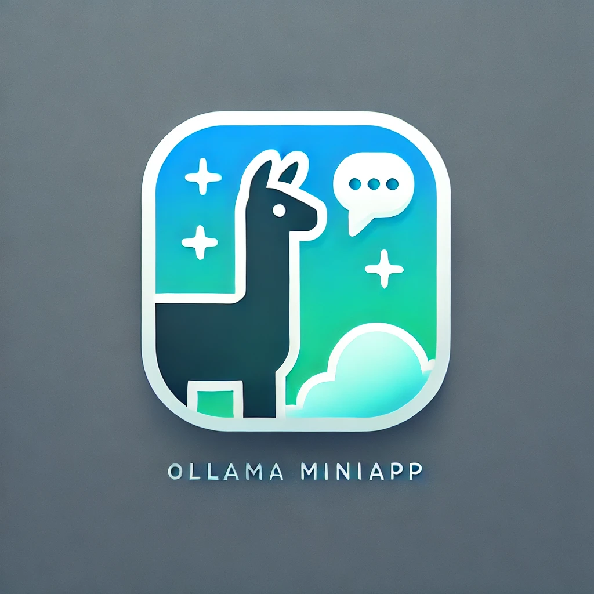
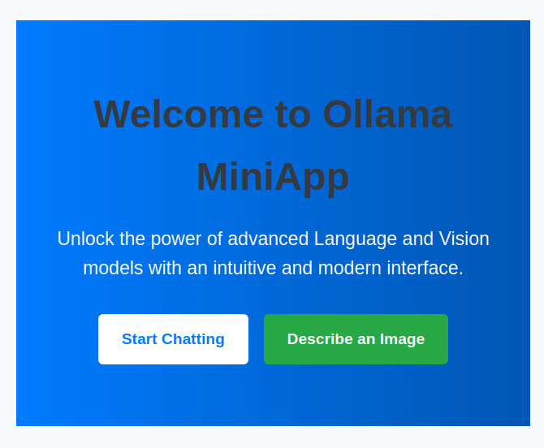
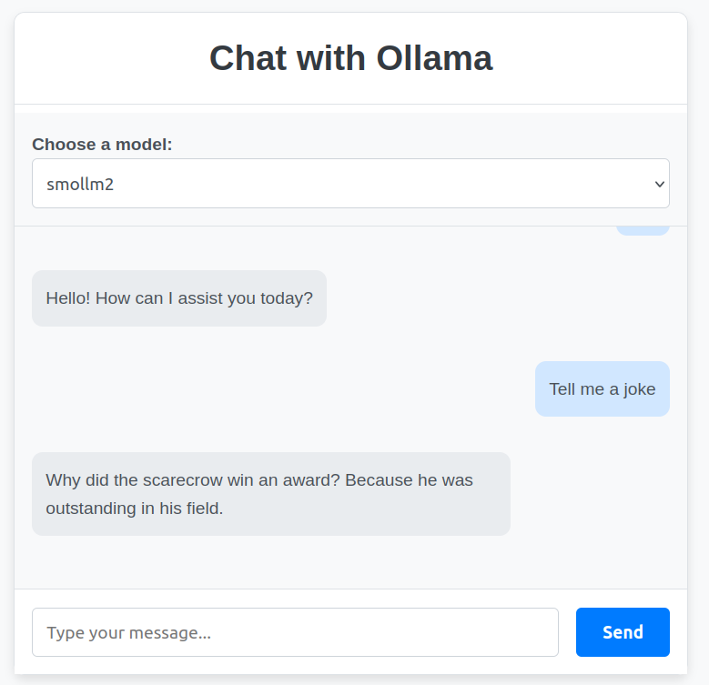
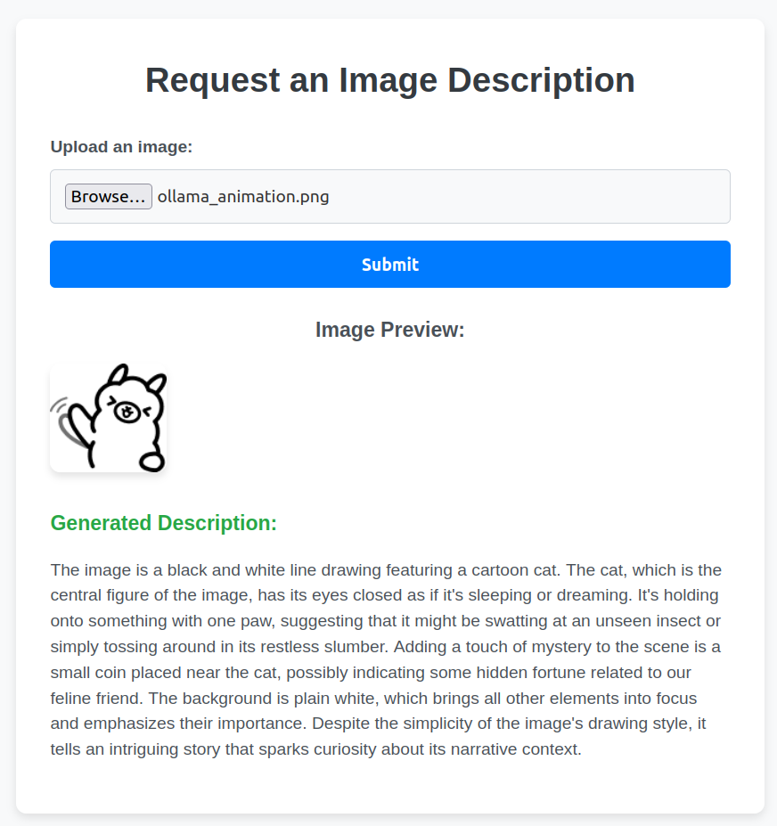

# Ollama MiniApp

<p align="center">
  
</p>

**Ollama MiniApp** is a web application that enables interaction with various language models (LLMs) like Llama, Gemma, or Mistral and vision-language models (VLMs) for image description, all through an intuitive user interface. This project is built with a FastAPI backend, a Vue.js frontend, and utilizes Ollama to run these models efficiently.

---

## Features

- **Intuitive User Interface**: A modern, responsive design for interacting with language models.
- **Model Selection**: Choose from a list of predefined models directly in the interface.
- **Image Description**: Generate descriptions for uploaded images.
- **Extensible Backend**: Built on FastAPI to facilitate robust API management.
- **Dockerized Deployment**: Quick setup and deployment using Docker Compose.
- **Customizable Models**: Manage and configure models easily with environment variables.

---

## Screenshots

### Home Page

 <!-- Home interface screenshot -->

### Chat Page



### Image Description Page



---

## Architecture Overview

### Backend

- **Framework**: FastAPI
- **Key Components**:
  - `app/core`: Core utilities for configuration and logging.
  - `app/api/v1`: API routes for chat, image descriptions, and model management.
  - `app/services`: Service layer for handling API interactions with Ollama.

### Frontend

- **Framework**: Vue.js
- **Structure**:
  - `src/pages`: Individual pages for chat, home, and image description functionalities.
  - `src/components`: Reusable components for chat and image interactions.
  - `src/api`: API utility functions for backend communication.

### Models

- Managed via Ollama, supporting the latest LLM and VLM models.

---

## Prerequisites

- **Docker**: Install Docker and Docker Compose.
- **Node.js**: Required for frontend development if you intend to run locally.

---

## Installation and Deployment

### Development Setup

Use the following steps for local development with hot-reloading:

1. **Clone the Repository**:

   ```bash
   git clone https://github.com/akdavid/ollama_miniapp.git
   cd ollama_miniapp
   ```

2. **Set Up the Environment**:

   ```bash
   cp .env.example .env
   ```

3. **Start the Development Environment**:

   ```bash
   NODE_ENV=development docker-compose up --build
   ```

4. **Access the Interface**:
   - **Frontend**: [http://localhost:8080](http://localhost:8080)
   - **Backend API Docs**: [http://localhost:8000/docs](http://localhost:8000/docs)

In development mode:

- Changes to the frontend code will trigger hot-reloading.
- Backend code updates will restart the container automatically.

---

### Production Setup

Use these steps to build and deploy the application for production:

1. **Clone the Repository**:

   ```bash
   git clone https://github.com/akdavid/ollama_miniapp.git
   cd ollama_miniapp
   ```

2. **Set Up the Environment**:

   ```bash
   cp .env.example .env
   ```

3. **Build and Start the Production Environment**:

   ```bash
   NODE_ENV=production docker-compose up --build
   ```

4. **Access the Interface**:
   - **Frontend**: [http://localhost](http://localhost)
   - **Backend API Docs**: [http://localhost:8000/docs](http://localhost:8000/docs)

In production mode:

- The frontend is built and served as static files through Nginx.
- The backend runs with FastAPI, optimized for production.

---

## Usage

### Chat with a Language Model

1. **Select a Model**: Use the dropdown menu on the chat page.
2. **Send a Message**: Enter a message and click "Send."
3. **Receive Responses**: View responses in a real-time conversation format.

### Image Description

1. **Upload an Image**: Use the form to upload an image file.
2. **Generate Description**: Click "Send" to receive a detailed description of the image.

---

## Troubleshooting

### Common Issues

1. **Port Already in Use**:

   - The port used for the Ollama container (`11434`) may already be in use by the Ollama application running natively on your system.
   - To stop the native Ollama service, use the following command:
     ```bash
     systemctl stop ollama.service
     ```

2. **Insufficient RAM for Image Descriptions**:
   - Generating image descriptions may fail if there is not enough available RAM.
   - Solution:
     - Free up RAM by closing unnecessary applications.
     - Use a smaller model configured via the `VLM_MODEL` environment variable.

### Removing Unused Models in Ollama

To delete a model from the Ollama container, use these commands:

```bash
docker exec -it ollama_miniapp-ollama-1 bash
ollama rm <model_name>
```

---

## Tasks Progress

- [x] Chat with a language model (LLM).
- [x] Dropdown for model selection.
- [x] Image description with a vision-language model (VLM).

---

## To Do List

- [ ] [OPS] Add CI/CD for the build of the app, the tests, and code formatting.
  - [ ] [FRONT] Add unit tests for the frontend.
  - [ ] [FRONT] Add code formatting.
- [ ] [FULL] Add button to add a new LLM model from the web interface.
- [ ] [FULL] Improve error handling for image description failures due to insufficient RAM or model limitations.
- [ ] [BACK] Add support for GPU inference in the Ollama container.
- [ ] [FRONT] Enhance the interface with real-time feedback for responses.
- [ ] [BACK] Add history of the chat in LLM prompt (persistence).
- [ ] [FRONT] Add Light/Dark modes.
- [x] [FULL] Add a prompt for the image description.
- [ ] [FRONT] Add drag and drop for the uploaded image.
- [ ] [FRONT] Try Tailwind CSS.
- [ ] [NA] Add a documentation using Sphinx or MkDocs.
- [ ] [FRONT] Add markdown visualization of chat responses.

Do not hesitate to contribute! :)

---

## Environment Variables

Configure these variables in `.env`:

- **`LLM_MODELS`**: A comma-separated list of available language models (e.g., `gemma:2b,llama3.2:3b,mistral:7b`).
- **`OLLAMA_API_URL`**: The base URL for Ollama's API (default: `http://ollama:11434`).
- **`VLM_MODEL`**: Vision-language model for image descriptions.

---

## Contribution

Contributions are welcome! If you'd like to add features or fix issues:

1. Fork the repository.
2. Create a feature branch.
3. Make your changes and test locally.
4. Submit a pull request with a clear explanation of your changes.

---

## License

This project is licensed under the [MIT License](./LICENSE).
