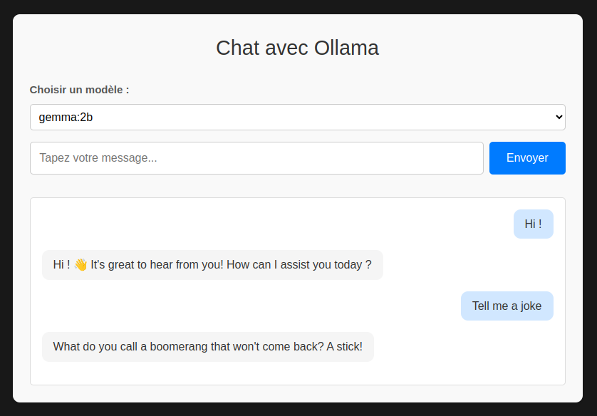

# Ollama MiniApp

**Ollama MiniApp** est une application web permettant de dialoguer avec plusieurs modèles de langage, tels que Llama, Gemma, ou Mistral, via une interface utilisateur intuitive. Ce projet repose sur un backend FastAPI, un frontend Vue.js, et utilise Ollama pour exécuter les modèles de langage.

 <!-- Capture de l'interface principale -->

## Fonctionnalités

- **Interface utilisateur intuitive** : Une interface moderne pour envoyer des messages et afficher les réponses du modèle.
- **Sélection de modèle** : Choisissez parmi une liste de modèles prédéfinis directement dans l'interface.
- **Backend extensible** : Basé sur FastAPI, pour une gestion facile des requêtes.
- **Déploiement Dockerisé** : Installation rapide avec Docker Compose.
- **Personnalisation des modèles** : Configurez et gérez facilement les modèles via les variables d'environnement.

## Architecture

- **Frontend** : Développé avec Vue.js, offrant une interface interactive et réactive.
- **Backend** : API REST construite avec FastAPI pour gérer la communication entre le frontend et Ollama.
- **Modèles de langage** : Exécutés via l'API Ollama.

---

## Prérequis

- **Docker** : Installez Docker et Docker Compose avant de continuer.

---

## Installation et déploiement

1. **Clonez ce dépôt** :

   ```bash
   git clone https://github.com/akdavid/ollama_miniapp.git
   cd ollama_miniapp
   ```

2. **Configurez votre environnement** :

   ```bash
   cp .env.example .env
   ```

3. **Lancez l'application** :

   ```bash
   docker-compose up --build
   ```

4. **Accédez à l'interface web** : [http://localhost:8080](http://localhost:8080)

---

## Utilisation

1. **Sélectionnez un modèle** : Utilisez la liste déroulante en haut de la page pour choisir le modèle de langage avec lequel vous souhaitez interagir.
2. **Envoyez un message** : Tapez un message dans la barre de saisie et cliquez sur "Envoyer".
3. **Recevez une réponse** : Les messages de l'utilisateur s'affichent à droite, et les réponses du modèle apparaissent à gauche.

---

## Variables d'environnement

Les variables suivantes peuvent être configurées dans le fichier `.env` :

- **`LLM_MODELS`** : Une liste des modèles de langage disponibles, séparés par des virgules (exemple : `gemma:2b,llama3.2:3b,mistral:7b`).
  - Ces modèles doivent être compatibles avec Ollama. Une liste des modèles supportés est disponible sur [la bibliothèque Ollama](https://ollama.com/library).
- **`OLLAMA_API_URL`** : URL de l'API Ollama pour la génération de texte (par défaut : `http://ollama:11434/api/generate`).

---

## Ports utilisés

- **Frontend** : `8080`
- **Backend** : `8000`
- **Ollama** : `11434`

---

## Limitations connues

- **Prérequis matériels** : L'application est optimisée pour les CPU modernes avec support AVX2. Aucun GPU n'est requis pour les modèles actuels.
- **Modèles compatibles** : Actuellement, seuls les modèles disponibles via Ollama sont pris en charge.

---

## Contribution

Les contributions sont les bienvenues ! Si vous trouvez un bug ou souhaitez proposer une fonctionnalité, ouvrez une issue ou soumettez une pull request.

1. Clonez ce dépôt.
2. Créez une nouvelle branche pour vos modifications.
3. Testez votre code localement.
4. Envoyez une pull request avec une description claire.

---

## Licence

Ce projet est sous licence [MIT](./LICENSE).
